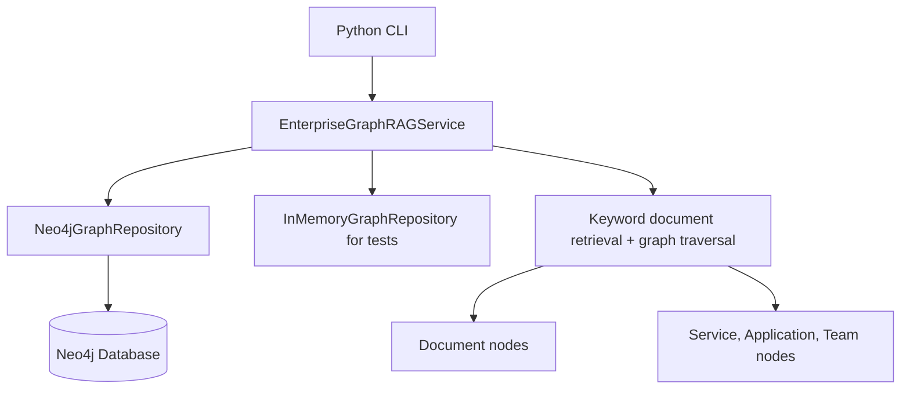
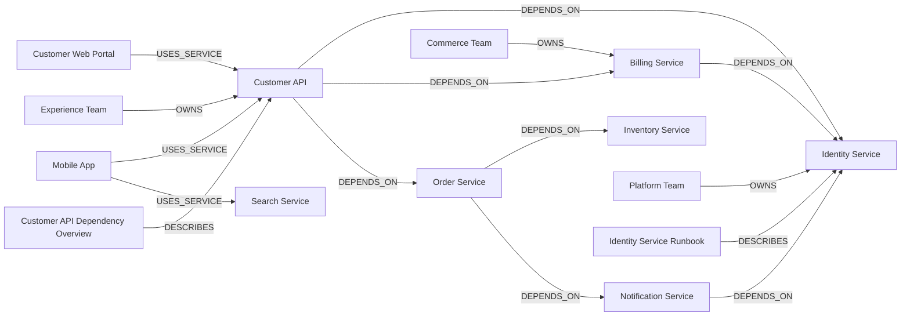

# neo4j-enterprise-graphrag

Reference implementation of enterprise GraphRAG with Neo4j for relationship-aware retrieval, service dependency analysis, and evidence-backed impact assessment.

## Project overview

This project demonstrates how a knowledge graph helps answer enterprise questions that require multi-hop reasoning, not just document similarity.

Primary use case:

> Which customer-facing applications could be affected if a service becomes unavailable?

The implementation ships with:

- a synthetic enterprise knowledge graph
- parameterized Neo4j Cypher queries
- a Python CLI for graph initialization and analysis
- a graph-based retrieval demo that works without a paid LLM API
- automated tests for dependency and impact scenarios

## Architecture



## Knowledge graph visualization



## Knowledge graph schema

### Node labels

- `Service` - enterprise services and APIs
- `Application` - consuming applications
- `Team` - owning teams
- `Document` - supporting operational or architecture documents

### Relationships

- `(:Service)-[:DEPENDS_ON]->(:Service)`
- `(:Application)-[:USES_SERVICE]->(:Service)`
- `(:Team)-[:OWNS]->(:Service)`
- `(:Document)-[:DESCRIBES]->(:Service)`

## Repository layout

```text
src/neo4j_enterprise_graphrag/
  cli.py
  config.py
  cypher.py
  models.py
  repository.py
  sample_data.py
  service.py
tests/
  test_service.py
  test_integration_neo4j.py
```

## Prerequisites

- Python 3.11+
- A running Neo4j 5.x instance

## Neo4j setup instructions

You can run Neo4j locally with Docker:

```bash
docker run \
  --name neo4j-graphrag \
  -p 7474:7474 -p 7687:7687 \
  -e NEO4J_AUTH=neo4j/please-change-me \
  neo4j:5
```

Set environment variables:

```bash
cp .env.example .env
# edit .env as needed, then export it into your shell
set -a
source .env
set +a
```

`NEO4J_GRAPH_SOURCE` is optional and defaults to the sample dataset name. Set it to a unique value when you want to isolate concurrent or side-by-side sample loads in the same Neo4j database.

## Installation instructions

```bash
python -m venv .venv
source .venv/bin/activate
pip install -e ".[dev]"
```

## Local run instructions

1. Start Neo4j.
2. Set the `NEO4J_*` environment variables.
3. Initialize the sample graph:

   ```bash
   neo4j-graphrag init-graph --reset
   ```

4. Run example queries:

   ```bash
   neo4j-graphrag service --name "Customer API"
   neo4j-graphrag impact --name "Identity Service"
   neo4j-graphrag impact --name "Identity Service" --max-depth 4
   neo4j-graphrag paths --source "Customer API" --target "Identity Service"
   neo4j-graphrag owners --name "Billing Service"
   neo4j-graphrag retrieve --question "Which customer-facing applications are affected if Identity Service fails?"
   ```

## Example commands

```bash
neo4j-graphrag init-graph --reset
neo4j-graphrag service --name "Customer API" --max-depth 4
neo4j-graphrag impact --name "Identity Service" --max-depth 4
neo4j-graphrag paths --source "Customer API" --target "Notification Service"
neo4j-graphrag retrieve --question "Show documents and graph evidence for Identity Service outage impact."
```

## Example output

```json
{
  "service": "Identity Service",
  "impacted_applications": [
    {
      "application": "Customer Web Portal",
      "dependent_service": "Customer API",
      "service_path": ["Customer API", "Identity Service"],
      "dependency_paths": [["Customer API", "Identity Service"]],
      "hops": 1
    },
    {
      "application": "Partner Dashboard",
      "dependent_service": "Billing Service",
      "service_path": ["Billing Service", "Identity Service"],
      "dependency_paths": [["Billing Service", "Identity Service"]],
      "hops": 1
    }
  ],
  "duration_ms": 3.2
}
```

## Dependency-path output example

When multiple chains lead to the same impacted application, the CLI returns the shortest `service_path` plus all discovered `dependency_paths`:

```json
{
  "application": "Customer App",
  "dependent_service": "Customer API",
  "service_path": [
    "Customer API",
    "Order Service",
    "Billing Service",
    "Identity Service"
  ],
  "dependency_paths": [
    ["Customer API", "Order Service", "Billing Service", "Identity Service"],
    ["Customer API", "Order Service", "Notification Service", "Identity Service"]
  ],
  "hops": 3
}
```

## Implemented Cypher queries

- Direct dependencies
- Multi-hop dependencies
- Downstream application impact analysis
- Dependency path discovery
- Service ownership lookup
- Document retrieval with graph expansion

All queries are defined in `src/neo4j_enterprise_graphrag/cypher.py` and executed with parameters.

## Implemented graph retrieval vs future GraphRAG extensions

### Implemented today

- keyword-based document retrieval over synthetic `Document` nodes
- graph traversal over `Service`, `Application`, and `Team` relationships
- evidence-backed dependency and impact answers with explicit path output
- no paid LLM or embedding service required

### Not implemented yet

- vector search or embedding indexes
- LLM answer synthesis over retrieved graph/document context
- hybrid vector + graph ranking

Traditional vector RAG can retrieve documents that mention a service outage, but it does not naturally explain transitive impact across application and service relationships.

This project demonstrates a graph-first retrieval workflow:

1. retrieve supporting documents by local keyword overlap
2. identify related service nodes
3. traverse the knowledge graph for owners, dependencies, and impacted applications
4. return evidence paths that explain why an application is affected

This makes relationship paths explicit and auditable, which is critical for dependency analysis and operational decision support.

## Reliability and engineering considerations

- Neo4j configuration is provided through environment variables
- all Cypher execution uses parameters
- CLI and service inputs are validated
- missing services return clear errors
- empty query results are returned explicitly instead of failing
- execution timing is returned for query operations
- logging is configurable with `NEO4J_LOG_LEVEL`
- sample graph loading is idempotent because node and relationship creation uses `MERGE`

## Automated tests

Run:

```bash
pytest
```

Optional disposable-Neo4j integration tests:

```bash
RUN_NEO4J_INTEGRATION=1 pytest
```

The default suite validates traversal logic and service behavior with the in-memory repository. The optional integration suite starts a disposable Neo4j container with Docker and verifies graph seeding plus impact-query behavior against the live driver.

## Known limitations

- The CLI does not infer complex entities beyond exact service-name matches in questions.
- The retrieval demo uses keyword overlap rather than embeddings.
- Disposable Neo4j integration tests require Docker and are skipped unless explicitly enabled.

## Future enhancements

- optional vector indexing and embedding-based retrieval
- richer natural language entity extraction
- graph visualization output for impact paths
- LLM-generated summaries grounded in graph traversal results

## Security and data hygiene

- The repository uses synthetic enterprise entities only.
- No proprietary company references or credentials are included.
- `.env` files are ignored; use `.env.example` as the template.
