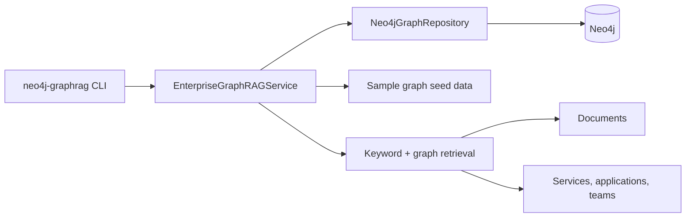
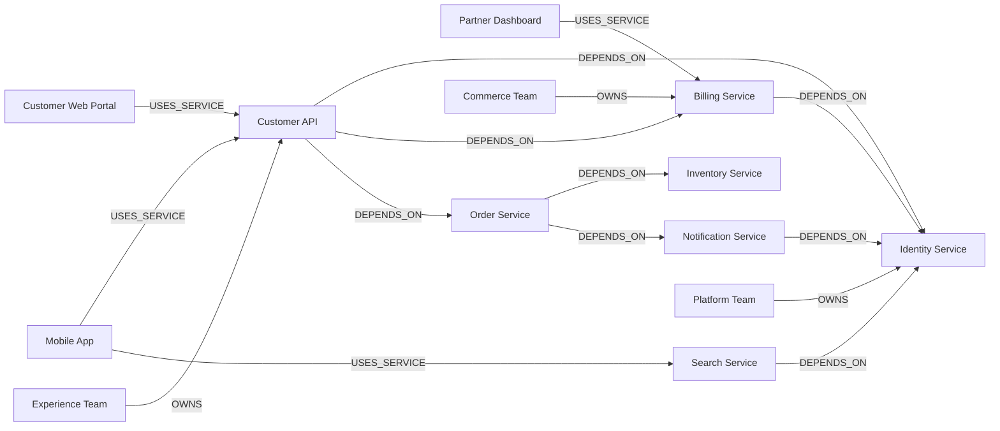

# neo4j-enterprise-graphrag

Educational enterprise GraphRAG reference implementation built with Python and Neo4j. The repository models teams, applications, services, and supporting documents in a synthetic knowledge graph so you can explore multi-hop dependency analysis and relationship-aware retrieval without proprietary data or a paid LLM API.

## What is included

This repository contains one Neo4j-focused reference implementation under `src/neo4j_enterprise_graphrag` with:

- graph initialization for a synthetic enterprise dataset
- service dependency traversal and path discovery
- impacted application analysis with dependency evidence paths
- ownership lookup for services
- graph-aware document retrieval
- `graph_source` isolation for seeded datasets
- unit tests plus Neo4j integration tests

## Repository layout

```text
.
├── .env.example
├── .github/workflows/tests.yml
├── pyproject.toml
├── src/neo4j_enterprise_graphrag
│   ├── cli.py
│   ├── config.py
│   ├── cypher.py
│   ├── models.py
│   ├── repository.py
│   ├── sample_data.py
│   └── service.py
└── tests
```

## Architecture diagram



## Graph visualization



## Knowledge graph concepts

The synthetic graph uses these core node types:

- `Team`
- `Application`
- `Service`
- `Document`

And these relationship types:

- `(:Application)-[:USES_SERVICE]->(:Service)`
- `(:Service)-[:DEPENDS_ON]->(:Service)`
- `(:Team)-[:OWNS]->(:Service)`
- `(:Document)-[:DESCRIBES]->(:Service)`

Representative questions include:

- Which applications are impacted if `Identity Service` fails?
- Which services depend on `Billing Service` within three hops?
- Which teams own the services in a dependency path?
- Which documents provide supporting evidence for a retrieval answer?

## Retrieval scope

Implemented today:

- local keyword matching across bundled documents
- graph expansion to related services, owners, dependencies, and impacted applications
- evidence-rich responses that include supporting documents and graph context

Future GraphRAG extensions:

- vector or embedding search for semantic document retrieval
- LLM-assisted answer synthesis over retrieved graph and document context
- hybrid ranking that combines semantic, keyword, and graph signals

## Prerequisites

- Python 3.11+
- Optional: a running Neo4j instance for live graph loading and queries
- Optional: Docker for disposable integration tests outside CI

## Setup

### 1. Create a virtual environment

```bash
python -m venv .venv
source .venv/bin/activate
```

### 2. Install the project

```bash
pip install -e ".[dev]"
```

### 3. Optional: configure Neo4j

Copy the sample environment file and update it for your local Neo4j instance:

```bash
cp .env.example .env
set -a
source .env
set +a
```

Environment variables used by the CLI:

- `NEO4J_URI`
- `NEO4J_USERNAME`
- `NEO4J_PASSWORD`
- `NEO4J_DATABASE` (defaults to `neo4j`)
- `NEO4J_LOG_LEVEL`
- `NEO4J_GRAPH_SOURCE` (used to isolate seeded sample graphs in Neo4j)

### 4. Optional: run Neo4j locally with Docker

```bash
docker run \
  --name neo4j-graphrag \
  -p 7474:7474 -p 7687:7687 \
  -e NEO4J_AUTH=neo4j/please-change-me \
  neo4j:5
```

## CLI usage

Initialize the graph:

```bash
neo4j-graphrag init-graph --reset
```

Inspect service dependencies:

```bash
neo4j-graphrag service --name "Customer API" --max-depth 4
```

Find impacted applications:

```bash
neo4j-graphrag impact --name "Identity Service" --max-depth 4
```

Find dependency evidence paths:

```bash
neo4j-graphrag paths --source "Customer API" --target "Identity Service"
```

Look up owners:

```bash
neo4j-graphrag owners --name "Identity Service"
```

Run the retrieval demo:

```bash
neo4j-graphrag retrieve --question "What breaks if Identity Service is down?"
```

## Testing

Run the unit suite:

```bash
pytest -m "not integration"
```

Run Neo4j integration tests against a local or CI-provided Neo4j instance:

```bash
RUN_NEO4J_INTEGRATION=1 pytest -m integration
```

If you already have a Neo4j test instance running, you can point the integration suite at it:

```bash
RUN_NEO4J_INTEGRATION=1 \
NEO4J_TEST_URI=bolt://127.0.0.1:7687 \
NEO4J_TEST_USERNAME=neo4j \
NEO4J_TEST_PASSWORD=test-password \
pytest -m integration
```

## Educational goals

This repository is intentionally modular so contributors can extend it with:

- more Cypher templates for service impact analysis
- additional node types such as databases, APIs, or business capabilities
- vector, embedding, and LLM-powered retrieval components beyond the implemented keyword + graph workflow
- UI, notebook, or tutorial walkthroughs for GraphRAG experimentation
